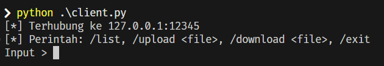
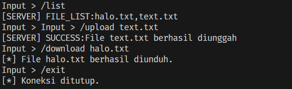
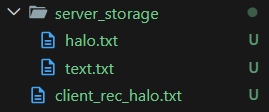
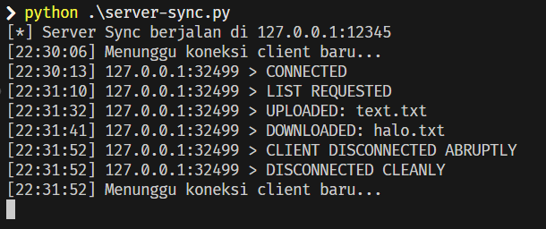

[](https://classroom.github.com/a/mRmkZGKe)
# Network Programming - Assignment G01

## Anggota Kelompok
| Nama           | NRP        | Kelas     |
| ---            | ---        | ----------|
|Zulkarnaen Ramdhani | 5025241043 | ProgJar D |
| Vityaz Ali Firdaus | 5025241050 | ProgJar D |
|                |            |           |

## Link Youtube (Unlisted)
Link ditaruh di bawah ini
```
https://youtu.be/mqZDwa2pu_A
```

## Penjelasan Program

### 1. Pendekatan Asynchronous pada Klien (`client.py`)
Pendekatan pada sisi klien menggunakan modul `threading`  untuk memisahkan proses input pengguna dan proses penerimaan data dari server agar dapat berjalan secara bersamaan.

```python
def receive_messages(sock):
    while True:
        try:
            response = sock.recv(4096).decode()
            if not response: break
            # proses menyimpan file / mencetak pesan
        except:
            break

def start_client():
    try:
        # proses koneksi ke server
        threading.Thread(target=receive_messages, args=(client,), daemon=True).start()

        while True:
            user_input = input("Input > ")
            # proses pengiriman perintah
    except Exception as e:
        # penanganan error
```

Fungsi `input()` akan memblokir program utama karena harus menunggu pengguna selesai mengetik. Hal ini menyebabkan pesan balasan atau obrolan *broadcast* dari server tidak bisa diterima secara *real-time*. Dengan mendelegasikan fungsi `receive_messages` ke dalam sebuah `threading.Thread` terpisah yang bersifat *daemon*, klien memiliki pendengar pasif yang selalu aktif di latar belakang.

Dengan cara ini, *thread* utama (Main Thread) dapat sepenuhnya berfokus melayani *loop* input pengguna untuk mengirim berbagai perintah tanpa hambatan. Sementara itu, *thread* lainnya akan secara otomatis menangkap data yang masuk kapan saja, tanpa mengganggu baris input yang sedang digunakan oleh pengguna.

### 2. Pendekatan Synchronous (`server-sync.py`)
Pendekatan dasar ini menggunakan arsitektur *synchronous* di mana server hanya melayani satu koneksi klien dalam satu waktu.

```python
def start_server():
    try:
        server.listen(1) 
        while True:
            conn, addr = server.accept()
            
            with conn:
                try:
                    while True:
                        data = conn.recv(4096).decode()
                        if not data: break
                        # proses penerimaan perintah
                except (ConnectionResetError, BrokenPipeError):
                    # penanganan jika klien terputus paksa
    except Exception as e:
        # penanganan error
```

Fungsi `server.accept()` akan memblokir (*block*) jalannya program utama sampai ada klien yang berhasil terhubung. Setelah koneksi terjalin, program akan masuk ke dalam *loop* komunikasi (blok `with conn`) dan tertahan pada fungsi `conn.recv()` untuk terus melayani pertukaran data, seperti perintah upload, download, atau chat dari klien tersebut.

Server secara efektif mengunci diri dan hanya berfokus pada satu klien. Jika ada klien lain yang mencoba terhubung, mereka akan dimasukkan ke dalam antrean sistem operasi terlebih dahulu karena kita membatasinya dengan `server.listen(1)`. Program baru akan kembali ke posisi `server.accept()` untuk melayani klien di antrean berikutnya setelah klien pertama secara resmi memutuskan koneksi.

---

### 3. Pendekatan Multi-Threading (`server-thread.py`)
   Pendekatan pertama menggunakan modul threading bawaan Python untuk mendelegasikan setiap koneksi klien ke dalam proses atau "jalur" yang terpisah.

```python
clients = [] 

def start_server():
    try:
        while True:
            conn, addr = server.accept()
            clients.append(conn)
            
            thread = threading.Thread(target=handle_client, args=(conn, addr))
            thread.daemon = True
            thread.start()
    except Exception as e:
        print(f"[!] Server error: {e}")
```

Pada arsitektur synchronous, fungsi server.accept() dan proses penerimaan pesan ( recv() ) akan memblokir (block) jalannya program utama. Dengan menggunakan threading.Thread, setiap kali ada klien baru yang terhubung, server akan menugaskan sebuah thread baru untuk menjalankan fungsi handle_client.

Dengan cara ini, thread utama (Main Thread) dapat langsung kembali ke posisi server.accept() untuk menunggu klien berikutnya, sementara thread anakan mengurus transfer file dan chat dari klien yang sudah terhubung. Selain itu, ditambahkan list clients secara global untuk menyimpan koneksi yang aktif, yang nantinya di-looping pada fungsi broadcast() agar pesan chat dari satu klien dapat diteruskan ke klien lainnya secara real-time.

### 4. Pendekatan I/O Multiplexing (`server-select.py`)
   Pendekatan kedua menggunakan modul select untuk memantau aktivitas banyak socket sekaligus dalam satu thread tunggal (tanpa membuat thread baru).

```python
sockets_list = [server] 
clients = {} 

def start_server():
    try:
        while True:
            read_sockets, _, exception_sockets = select.select(sockets_list, [], sockets_list)

            for notified_socket in read_sockets:
                if notified_socket == server:
                    conn, addr = server.accept()
                    sockets_list.append(conn)
                    clients[conn] = addr
                
                else:
                    data = notified_socket.recv(4096).decode()
```

Alih-alih membuat banyak thread yang dapat membebani CPU dan memori, metode ini memanfaatkan I/O Multiplexing. Fungsi select.select() menerima daftar koneksi (sockets_list) dan akan menahan program sampai ada salah satu socket yang menerima data (baik itu koneksi baru ke server, maupun pesan dari klien).

Ketika ada aktivitas, program akan mengecek: apakah aktivitas tersebut berasal dari server (berarti ada klien baru mendaftar), atau dari socket klien lama (berarti klien tersebut mengirimkan file atau chat). Karena semuanya diproses dalam satu loop secara efisien, metode ini jauh lebih hemat sumber daya (resource) dibandingkan metode threading, terutama jika jumlah klien mulai bertambah.

### 5. Pendekatan Polling (`server-poll.py`)
   Pendekatan ketiga menggunakan system call poll() yang fungsinya serupa dengan select, namun didesain untuk menangani jumlah koneksi yang jauh lebih masif (skalabilitas tinggi).

```python
def start_server():
    
    try:
        poller = select.poll()
    except AttributeError:
        print("[!] Error: Sistem operasi ini (kemungkinan Windows) tidak mendukung select.poll(). Gunakan Linux/macOS.")
        return

    poller.register(server, select.POLLIN)
    fd_to_socket = {server.fileno(): server}
    
    # ... [looping events = poller.poll() dan pemrosesan I/O] ...
```

Fungsi poll() lebih efisien dari select() karena tidak mengharuskan sistem operasi untuk memindai ulang seluruh daftar socket setiap kali ada kejadian baru. Metode ini langsung memetakan File Descriptor (FD) dari socket yang aktif.

Pada implementasi ini, disisipkan sebuah blok try-except AttributeError sebagai bentuk error handling. Hal ini dikarenakan fungsi select.poll() merupakan fitur native dari sistem operasi keluarga Unix/Linux dan tidak didukung oleh sistem operasi Windows. Saat program dijalankan di lingkungan Windows (seperti pada PowerShell), program akan menangkap error tersebut dan memberikan pesan peringatan yang elegan tanpa menyebabkan aplikasi crash secara mendadak. Hal ini menunjukkan pemahaman yang baik terkait lingkungan sistem operasi dalam pemrograman jaringan (Network Programming).

## Screenshot Hasil
- Koneksi client ke server <br>


- client mengirim pesan ke server dan mendapat respon dari server <br>


- hasil upload dan download yang dilakukan client <br>


- tampilan log pada server <br>


- Tampilan output klien pertama yang menunjukkan penerimaan pesan chat siaran "Halo" dari pengguna lain dan hasil eksekusi perintah /list.            


- Tampilan proses pengiriman pesan chat siaran, serta demonstrasi keberhasilan perintah /upload dan /download file tes.txt.            
            

- Tampilan log log aktivitas dari server-thread.py yang merekam koneksi dua klien sekaligus dan memproses permintaan chat broadcast, upload file, permintaan daftar, serta download file dari mereka.                
            

- Bukti struktur file proyek yang menunjukkan bahwa file client_rec_tes.txt benar-benar berhasil diunduh dan tersimpan di direktori lokal.
  


